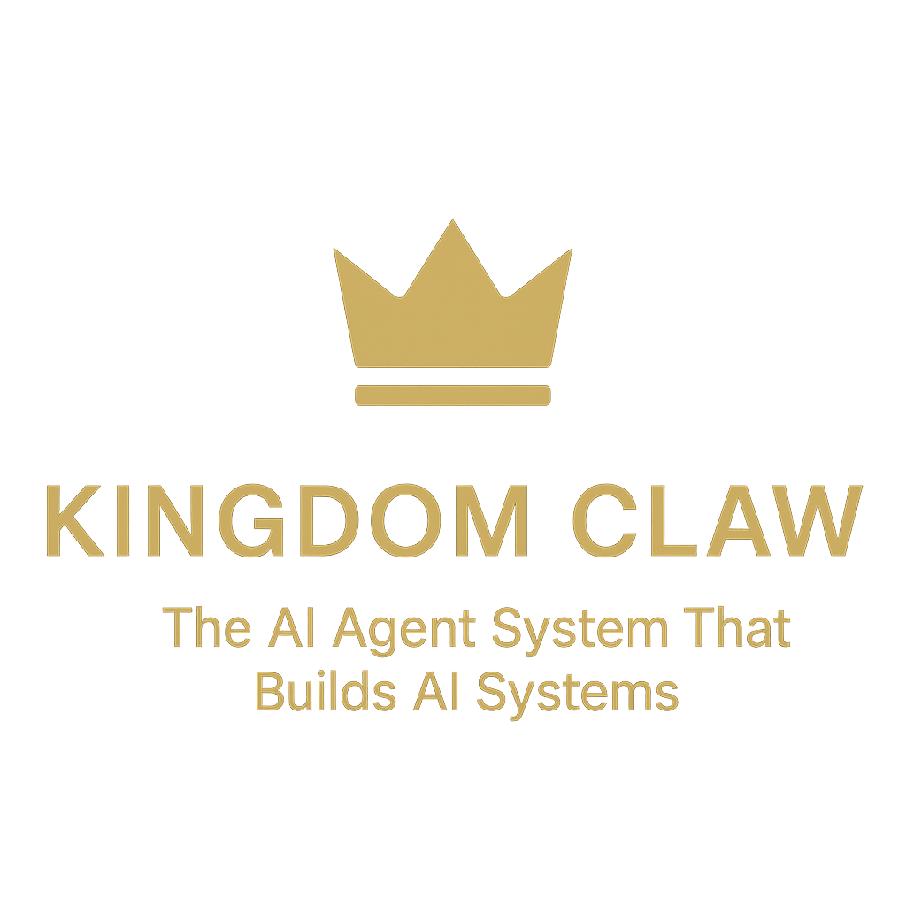

<!-- Social Preview Image -->


<div align="center">
<br/>


<br/><br/>

### 🧠 "One agent learns, all agents benefit. Every failure becomes improvement."

</div>

---

## 🎬 See It In Action

<div align="center">

https://github.com/user-attachments/assets/kingdom-claw-demo.mp4

**⚡ Watch the agent network visualize in real-time**

<br/>

https://github.com/user-attachments/assets/agent-builder-demo.mp4

**🔧 See the system write its own code and spawn specialized agents**

</div>

---

## 🎯 What Is This?

This is the **complete blueprint** for Kingdom Claw — an AI agent system that doesn't just chat, it **acts**.

```
┌─────────────────────────────────────────────────────────────────┐
│                                                                 │
│  YOU: "Send an email to my leads"                               │
│                                                                 │
│  ┌─────┐   ┌─────────────┐   ┌──────────────┐   ┌───────┐     │
│  │ 🧠  │───►│ 🎯 ORCHESTRA│───►│ ✉️ OUTREACH │───►│ SENT! │     │
│  │ LLM │   │   ROUTER    │   │    AGENT     │   │  ✓    │     │
│  └─────┘   └─────────────┘   └──────────────┘   └───────┘     │
│                                                                 │
│  YOU: "Check inbox and reply"                                   │
│                                                                 │
│  ┌─────┐   ┌─────────────┐   ┌──────────────┐   ┌───────┐     │
│  │ 🧠  │───►│ 📨 INBOX    │───►│ 💬 COMPOSER  │───►│REPLIED│     │
│  │ LLM │   │  WATCHER    │   │    AGENT     │   │  ✓    │     │
│  └─────┘   └─────────────┘   └──────────────┘   └───────┘     │
│                                                                 │
│  YOU: "Build me a landing page"                                 │
│                                                                 │
│  ┌─────┐   ┌─────────────┐   ┌──────────────┐   ┌───────┐     │
│  │ 🧠  │───►│ 🎨 DESIGNER │───►│ ⚡ DEVELOPER │───►│ LIVE! │     │
│  │ LLM │   │   AGENT     │   │    AGENT     │   │  🌐   │     │
│  └─────┘   └─────────────┘   └──────────────┘   └───────┘     │
│                                                                 │
└─────────────────────────────────────────────────────────────────┘
```

**This is not ChatGPT.** This is an autonomous system that runs your business while you sleep.

---

## ⚡ What Makes This Different

| Regular AI Chatbot | Kingdom Claw |
|-------------------|--------------|
| 🗣️ Talks about work | ⚡ **Does the work** |
| 📝 Writes code snippets | 🚀 **Writes, runs, deploys code** |
| 💬 Suggests emails | ✉️ **Sends and manages emails** |
| 🔗 Shares links | 🌐 **Browses, scrapes, interacts** |
| 🧠 Forgets everything | 💾 **Remembers everything** |
| ⏰ Only when you chat | ⏰ **Works 24/7 autonomously** |
| 👤 One brain | 👥 **60+ specialized agents** |

---

## 📦 What's Inside

### 🧠 11 Integrated Knowledge Systems

<table>
<tr>
<td width="50%">

**Agent Intelligence**
- 🎭 **agency-agents** — 60+ agent personalities
- 🧠 **antigravity-awesome-skills** — 1,340+ production skills
- 📚 **Agentic-Design-Patterns** — 21 core patterns + PDF

</td>
<td width="50%">

**Model Integration**
- 🤖 **GLM-5** — 744B reasoning model
- 🎨 **Kimi-K2.5** — 1T multimodal swarm
- 🔐 **NemoClaw** — NVIDIA sandbox security

</td>
</tr>
<tr>
<td width="50%">

**Evolution Engine**
- ⚡ **OpenSpace** — Self-evolution system
- 🔄 **FIX/DERIVE/CAPTURE** — Auto-improvement
- 📈 **46% fewer tokens, 4.2× better**

</td>
<td width="50%">

**Production Ready**
- 🛠️ **claude-code** — Anthropic's harness
- 🐍 **claw-code** — Python harness port
- 🌐 **openclaw** — Core framework

</td>
</tr>
</table>

---

### 🎭 60+ Agent Personalities

```
┌─────────────────────────────────────────────────────────────────┐
│                    KINGDOM CLAW AGENTS                          │
├─────────────────┬─────────────────┬─────────────────┬───────────┤
│   ENGINEERING   │    MARKETING    │     DESIGN      │   SALES   │
│      (23)       │      (27)       │       (8)       │    (8)    │
├─────────────────┼─────────────────┼─────────────────┼───────────┤
│ ▸ Frontend Dev  │ ▸ Growth Hacker │ ▸ UI Designer   │ ▸ Outbound│
│ ▸ Backend Arch  │ ▸ SEO Specialst │ ▸ UX Researcher │ ▸ Discovery│
│ ▸ DevOps Auto   │ ▸ Content Crtor │ ▸ UX Architect  │ ▸ Deals   │
│ ▸ Security Eng  │ ▸ TikTok Strtgt │ ▸ Brand Guardn  │ ▸ Proposals│
│ ▸ Data Engineer │ ▸ Reddit Builder│ ▸ Visual Story │ ▸ Pipeline│
│ ▸ Mobile Dev    │ ▸ LinkedIn Crtor│                 │           │
│ ▸ AI Engineer   │ ▸ WeChat Master │                 │           │
│ ▸ Code Reviewer │ ▸ Douyin Strtgt │                 │           │
│ ▸ SRE           │ ▸ ...20 more    │                 │           │
│ ▸ ...14 more    │                 │                 │           │
└─────────────────┴─────────────────┴─────────────────┴───────────┘
```

---

### 🔄 Self-Evolution Engine

The system **improves itself**:

```
┌──────────┐   ┌──────────┐   ┌──────────┐   ┌──────────┐
│ EXECUTE  │───►│ ANALYZE  │───►│ DETECT   │───►│ FIX /    │
│  TASK    │   │ RESULTS  │   │ PATTERN  │   │ DERIVE   │
└──────────┘   └──────────┘   └──────────┘   └──────────┘
      │              │              │              │
      ▼              ▼              ▼              ▼
┌──────────┐   ┌──────────┐   ┌──────────┐   ┌──────────┐
│ BETTER   │◄───│ UPDATE   │◄───│ CREATE   │◄───│ CAPTURE  │
│ SKILLS   │   │ SKILLS   │   │ ENHANCED │   │ NOVEL    │
└──────────┘   └──────────┘   └──────────┘   └──────────┘
```

**Results from OpenSpace research:**
- 📉 **46% fewer tokens** through skill reuse
- 📈 **4.2× better performance** on benchmarks
- 🔧 **Auto-fixes** when tools/APIs change

---

## 🚀 Quick Deploy

```bash
# Clone
git clone https://github.com/ClawKingAI/Super-Kingdom-Claw-Docs.git
cd Super-Kingdom-Claw-Docs

# Install
npm install -g openclaw

# Configure
cp reference/CONFIG-TEMPLATE.yaml ~/.openclaw/config.yaml
# Add your API keys

# Launch
openclaw gateway start
```

---

## 📁 Repository Structure

```
Super-Kingdom-Claw-Docs/
│
├── 📖 README.md           ← You are here
├── 📋 LICENSE.md          ← Usage terms
│
├── 🏗️ architecture/       ← How it works
│   ├── SYSTEM-OVERVIEW.md ← The big picture
│   ├── CORE-RUNTIME.md    ← Agent harness
│   ├── PERMISSION-SYSTEM.md ← Security
│   └── EVENT-STREAMING.md ← Observability
│
├── 🧠 integration/        ← Claude Code patterns
│   ├── CLAUDE-CODE-PATTERNS.md
│   ├── HOOKS.md
│   ├── SKILL-FRONTMATTER.md
│   └── ORCHESTRATION-WORKFLOW.md
│
├── 🎭 kingdom-claw-core/  ← Agent system
│   ├── runtime.py         ← Production harness
│   ├── personas/library/  ← 60+ agents
│   └── plugins/           ← Extensions
│
├── 🎬 assets/videos/      ← Demo videos
│   ├── kingdom-claw-demo.mp4
│   └── agent-builder-demo.mp4
│
└── 🚀 deployment/         ← Go live
    ├── VPS-SETUP.md
    └── PRODUCTION-CHECKLIST.md
```

---

## 🎓 The 21 Design Patterns

Every task runs through these patterns automatically:

<div align="center">

| Core | Advanced | Production | Enterprise |
|:----:|:--------:|:----------:|:----------:|
| 1. Prompt Chaining | 8. Memory Mgmt | 12. Exception Handling | 15. A2A Comm |
| 2. Routing | 9. Adaptation | 13. Human-in-Loop | 16. Resource Opt |
| 3. Parallelization | 10. MCP | 14. RAG | 17. Reasoning |
| 4. Reflection | 11. Goal Setting | | 18. Guardrails |
| 5. Tool Use | | | 19. Evaluation |
| 6. Planning | | | 20. Prioritization |
| 7. Multi-Agent | | | 21. Exploration |

</div>

---

## 💡 Use Cases

<div align="center">

| What You Want | What Kingdom Claw Does |
|---------------|------------------------|
| **Email outreach** | Sends, tracks, auto-replies, schedules |
| **Content creation** | Writes, designs, publishes |
| **Lead generation** | Scrapes, enriches, qualifies |
| **Customer support** | Responds, routes, escalates |
| **Code deployment** | Writes, tests, ships |
| **Data analysis** | Collects, processes, reports |

</div>

---

## 📞 Get Access

This documentation is available with a Kingdom Claw license.

**Includes:**
- ✅ Complete source code & documentation
- ✅ 60+ agent personalities
- ✅ 1,340+ skill library
- ✅ Self-evolution engine
- ✅ 21 design patterns
- ✅ 1 year updates

---

<div align="center">

**👑 Kingdom Claw**

*The AI Agent System That Builds AI Systems*

*Build Once. Run Forever. Evolve Always.*

</div>
