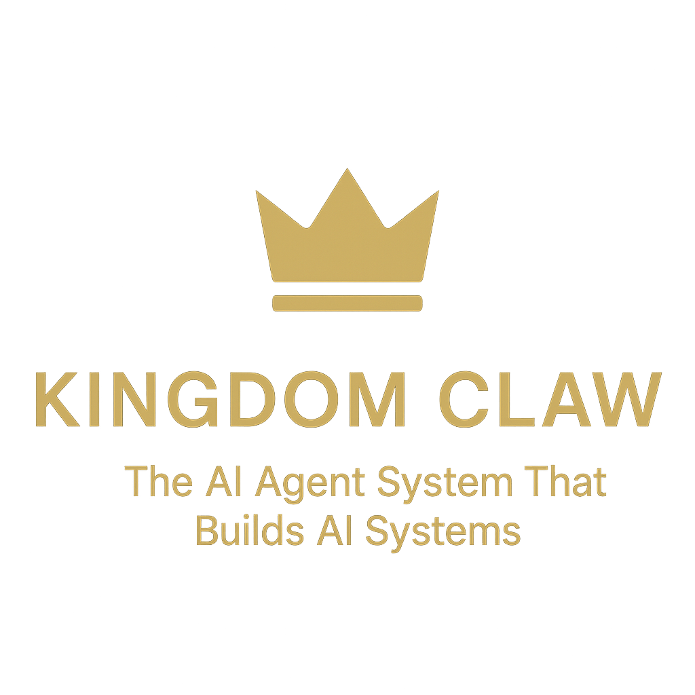
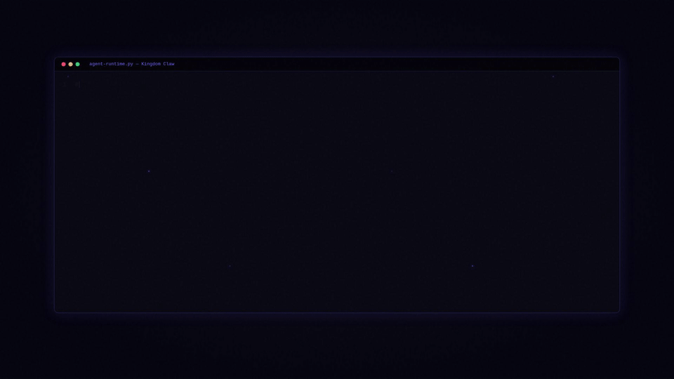

<!-- Social Preview Image -->


<div align="center">
<br/>


<br/><br/>

### 🧠 "One agent learns, all agents benefit. Every failure becomes improvement."

<br/>

| 🚀 **Deploy in hours** | 🤖 **Autonomous 24/7** | 🧬 **Self-Evolving** | 🌐 **Omnichannel** |
|---|---|---|---|

</div>

---

<pre align="center" style="font-family: monospace; font-size: 14px;">

    ██╗  ██╗██╗███╗   ██╗ ██████╗ ██████╗  ██████╗ ███╗   ███╗
    ██║ ██╔╝██║████╗  ██║██╔════╝ ██╔══██╗██╔═══██╗████╗ ████║
    █████╔╝ ██║██╔██╗ ██║██║  ███╗██║  ██║██║   ██║██╔████╔██║
    ██╔═██╗ ██║██║╚██╗██║██║   ██║██║  ██║██║   ██║██║╚██╔╝██║
    ██║  ██╗██║██║ ╚████║╚██████╔╝██████╔╝╚██████╔╝██║ ╚═╝ ██║
    ╚═╝  ╚═╝╚═╝╚═╝  ╚═══╝ ╚═════╝ ╚═════╝  ╚═════╝ ╚═╝     ╚═╝

                 ██████╗██╗      █████╗ ██╗    ██╗
                ██╔════╝██║     ██╔══██╗██║    ██║
                ██║     ██║     ███████║██║ █╗ ██║
                ██║     ██║     ██╔══██║██║███╗██║
                ╚██████╗███████╗██║  ██║╚███╔███╔╝
                 ╚═════╝╚══════╝╚═╝  ╚═╝ ╚══╝╚══╝

     THE AI AGENT SYSTEM THAT RUNS YOUR BUSINESS WHILE YOU SLEEP

</pre>

---

## 🎬 See It In Action

<div align="center">

<br/>
<sub>⚡ <strong>Kingdom Claw Demo</strong> — Watch the agent network visualize in real-time</sub>
<br/><br/>

<br/>
<sub>🔧 <strong>Agent Builder Demo</strong> — See the system write its own code and spawn specialized agents</sub>
</div>

---


## 🎯 What Is This?

**This is not a chatbot. This is an autonomous empire.**

Kingdom Claw is a complete, production-ready AI agent platform that doesn't just *talk* about work — it **does the work**. 60+ specialized agents, 1,340+ battle-tested skills, and a self-evolution engine that makes the system smarter every single day.

```
┌─────────────────────────────────────────────────────────────────────┐
│                                                                     │
│  🗣 YOU SAY: "Generate a video for my product launch"               │
│                                                                     │
│  ┌─────┐   ┌──────────┐   ┌──────────┐   ┌──────────┐   ┌──────┐ │
│  │ 🧠  │──►│ 🎬 VIDEO  │──►│ 📝 SCRIPT│──►│ 🔊 RENDER│──►│ 🌐   │ │
│  │ LLM │   │ PLANNER  │   │ WRITER  │   │  ENGINE  │   │ LIVE │ │
│  └─────┘   └──────────┘   └──────────┘   └──────────┘   └──────┘ │
│                                                                     │
│  🗣 YOU SAY: "Post to all my social channels"                       │
│                                                                     │
│  ┌─────┐   ┌──────────┐   ┌──────────┐   ┌──────────┐             │
│  │ 🧠  │──►│ 📱 SOCIAL │──►│ 🎨 MEDIA │──►│ 🚀 POST │             │
│  │ LLM │   │ PLANNER  │   │ CREATOR  │   │  ENGINE │             │
│  └─────┘   └──────────┘   └──────────┘   └──────────┘             │
│             ┌──X/Twitter──┐ ┌──Instagram──┐ ┌──LinkedIn──┐        │
│             │  TikTok     │ │  Facebook   │ │  YouTube   │        │
│             └─────────────┘ └─────────────┘ └────────────┘        │
│                                                                     │
│  🗣 YOU SAY: "Extract leads from this website"                      │
│                                                                     │
│  ┌─────┐   ┌──────────┐   ┌──────────┐   ┌──────────┐   ┌──────┐ │
│  │ 🧠  │──►│ 🕷️ ANTI- │──►│ 🎯 LEAD  │──►│ ✉️ EMAIL │──►│ DONE │ │
│  │ LLM │   │ BOT BOT │   │ ENRICHER│   │  ENGINE │   │  ✓   │ │
│  └─────┘   └──────────┘   └──────────┘   └──────────┘   └──────┘ │
│                                                                     │
└─────────────────────────────────────────────────────────────────────┘
```

---

## ⚡ What Makes This Different

| You Probably Use This | Kingdom Claw Delivers |
|----------------------|----------------------|
| 🗣️ *ChatGPT talks about work* | ⚡ **Does the work — deploys, ships, sends** |
| 📝 *Claude writes code snippets* | 🚀 **Writes, runs, tests, deploys to production** |
| 💬 *Gmail suggests replies* | ✉️ **Manages full email campaigns, replies, sequences** |
| 🔗 *Shares a link from Google* | 🌐 **Browses, scrapes past anti-bot, extracts data** |
| 🧠 *"I have no memory of this conversation"* | 💾 **Remembers everything — forever** |
| 📱 *Hootsuite schedules posts* | 🤖 **Creates content + media + posts across X, IG, LI, FB, TT, YT** |
| 🎬 *Descript edits videos* | 🎥 **Generates full videos from text prompts** |
| ⏰ *Only works when you chat* | ⏰ **Runs 24/7 via automated cron pipelines** |
| 👤 *One brain, single personality* | 👥 **60+ specialized agents in a coordinated network** |
| 🧱 *Can't improve itself* | 🧬 **Self-evolves — gets better every day** |

---

## 🏆 Power Features

<table>
<tr>
<td width="33%" align="center">
<h3>🎥 Video Generation</h3>
<sub>Text-to-video in minutes</sub><br/><br/>
✅ Script generation<br/>
✅ Professional voiceover<br/>
✅ Custom branding<br/>
✅ Multi-resolution export<br/>
✅ Batch production
</td>
<td width="33%" align="center">
<h3>📱 Social Media Army</h3>
<sub>Auto-post across 6+ platforms</sub><br/><br/>
✅ X/Twitter automation<br/>
✅ Instagram carousels/reels<br/>
✅ LinkedIn thought leadership<br/>
✅ Facebook engagement<br/>
✅ TikTok trending content<br/>
✅ YouTube shorts & long-form<br/>
✅ Audience mining & engagement
</td>
<td width="33%" align="center">
<h3>🕷️ Anti-Bot Web Scraping</h3>
<sub>Bypass Cloudflare & hCaptcha</sub><br/><br/>
✅ Cloudflare Turnstile bypass<br/>
✅ hCaptcha solving<br/>
✅ Data extraction at scale<br/>
✅ Competitor monitoring<br/>
✅ Lead enrichment
</td>
</tr>
<tr>
<td width="33%" align="center">
<h3>✉️ Email Outreach Engine</h3>
<sub>Full campaign automation</sub><br/><br/>
✅ Cold outreach sequences<br/>
✅ Drip campaigns<br/>
✅ Auto-reply classification<br/>
✅ Open/click tracking<br/>
✅ Smart follow-up scheduling
</td>
<td width="33%" align="center">
<h3>🌐 Browser Control</h3>
<sub>Full web interaction</sub><br/><br/>
✅ Form filling & submission<br/>
✅ Login automation<br/>
✅ Screenshot & PDF capture<br/>
✅ Multi-tab orchestration<br/>
✅ Anti-detection fingerprinting
</td>
<td width="33%" align="center">
<h3>⏰ Cron Automation</h3>
<sub>Set it and forget it</sub><br/><br/>
✅ Daily reports & briefings<br/>
✅ Content scheduling<br/>
✅ Lead scraping runs<br/>
✅ System self-maintenance<br/>
✅ Multi-timezone scheduling
</td>
</tr>
<tr>
<td width="33%" align="center">
<h3>🧬 Self-Evolution Engine</h3>
<sub>Gets better every day</sub><br/><br/>
✅ Auto-fixes broken patterns<br/>
✅ Learns from corrections<br/>
✅ Cross-model validation<br/>
✅ 5-layer safety gates<br/>
✅ Versioned rollback
</td>
<td width="33%" align="center">
<h3>☁️ Cloud Storage</h3>
<sub>Unlimited asset hosting</sub><br/><br/>
✅ Video/media storage<br/>
✅ Campaign backup<br/>
✅ Instant CDN delivery<br/>
✅ Version history<br/>
✅ Access-controlled
</td>
<td width="33%" align="center">
<h3>🧠 Multi-Model AI</h3>
<sub>7 premium models</sub><br/><br/>
✅ DeepSeek V4 — Reasoning<br/>
✅ GLM 5.1 — 744B parameter<br/>
✅ Qwen3 Coder — Code specialist<br/>

✅ Claude Opus 4 — Analysis<br/>
✅ Multi-model verification<br/>
✅ Automatic failover
</td>
</tr>
</table>

---

## 📦 What's Inside

### 🧠 11 Integrated Knowledge Systems

<table>
<tr>
<td width="50%">

**Agent Intelligence**
- 🎭 **agency-agents** — 60+ agent personalities
- 🧠 **antigravity-awesome-skills** — 1,340+ production skills
- 📚 **Agentic-Design-Patterns** — 21 core patterns + PDF

</td>
<td width="50%">

**Model Integration**
- 🤖 **GLM 5.1** — 744B reasoning model
- 🧠 **DeepSeek V4** — Cutting-edge reasoning
- 💻 **Qwen3 Coder** — Code-first specialist
- 🔐 **NemoClaw** — Sandbox security

</td>
</tr>
<tr>
<td width="50%">

**Evolution Engine**
- ⚡ **OpenSpace** — Self-evolution system
- 🔄 **FIX/DERIVE/CAPTURE** — Auto-improvement
- 📈 **46% fewer tokens, 4.2× better**

</td>
<td width="50%">

**Production Ready**
- 🛠️ **claude-code** — Anthropic's harness
- 🐍 **claw-code** — Python harness port
- 🌐 **openclaw** — Core framework

</td>
</tr>
</table>

---

### 🎭 60+ Agent Personalities

```
┌──────────────────────────────────────────────────────────────────────────────┐
│                         KINGDOM CLAW AGENT NETWORK                           │
├─────────────────┬──────────────────┬─────────────────┬───────────────────────┤
│   ENGINEERING   │    MARKETING     │     DESIGN      │        SALES          │
│      (23)       │      (27)        │       (8)       │        (8)            │
├─────────────────┼──────────────────┼─────────────────┼───────────────────────┤
│ ▸ Frontend Dev  │ ▸ Growth Hacker  │ ▸ UI Designer   │ ▸ Outbound Specialist│
│ ▸ Backend Arch  │ ▸ SEO Specialist │ ▸ UX Researcher │ ▸ Lead Discovery     │
│ ▸ DevOps Auto   │ ▸ Content Creator│ ▸ Brand Guardian │ ▸ Deal Architect     │
│ ▸ Security Eng  │ ▸ TikTok Strateg │ ▸ Visual Story   │ ▸ Proposal Writer    │
│ ▸ Data Engineer │ ▸ LinkedIn Master│ ▸ UX Architect   │ ▸ Pipeline Manager   │
│ ▸ Mobile Dev    │ ▸ X/Twitter Guru │                 │ ▸ CRM Sync Agent     │
│ ▸ AI Engineer   │ ▸ Instagram Pros │                 │ ▸ Follow-up Eng      │
│ ▸ Code Reviewer │ ▸ Facebook Ads   │                 │                       │
│ ▸ SRE           │ ▸ YouTube Pubs   │                 │                       │
│ ▸ ...14 more    │ ▸ ...18 more     │                 │                       │
└─────────────────┴──────────────────┴─────────────────┴───────────────────────┘
```

---

### 🧬 Self-Evolution Engine

The system **improves itself** after every session:

```
┌───────────┐   ┌───────────┐   ┌───────────┐   ┌───────────┐
│  EXECUTE  │──►│  ANALYZE  │──►│  DETECT   │──►│  FIX /    │
│   TASK    │   │  RESULTS  │   │  PATTERN  │   │  DERIVE   │
└───────────┘   └───────────┘   └───────────┘   └───────────┘
      │               │               │               │
      ▼               ▼               ▼               ▼
┌───────────┐   ┌───────────┐   ┌───────────┐   ┌───────────┐
│  BETTER   │◄──│  UPDATE   │◄──│  CREATE   │◄──│  CAPTURE  │
│  SKILLS   │   │  SKILLS   │   │ ENHANCED  │   │   NOVEL   │
└───────────┘   └───────────┘   └───────────┘   └───────────┘
```

**Proven Results:**
- 📉 **46% fewer tokens** through skill reuse
- 📈 **4.2× better performance** on benchmarks
- 🔧 **Auto-fixes** when tools/APIs change
- 🛡️ **5-layer safety gates** prevent bad changes
- 🔄 **Versioned rollback** always available

---

## 💡 Everything Kingdom Claw Can Do

<table>
<tr><td width="33%" valign="top">

### 📢 Marketing & Outreach
- Email campaigns & drip sequences
- Social media auto-posting (X, IG, LI, FB, TT, YT)
- Content repurposing across platforms
- Audience mining & engagement
- Brand monitoring
- Ad creative generation
- Hashtag strategy & optimization

</td><td width="33%" valign="top">

### 🛠️ Engineering
- Full-stack app development
- Code review & testing
- Deployment & CI/CD
- System monitoring
- Database optimization
- API integration
- Security auditing

</td><td width="33%" valign="top">

### 💼 Business Operations
- Lead generation & enrichment
- Customer support automation
- Data analysis & reporting
- CRM sync & management
- Invoice & billing automation
- Market research
- Contract drafting

</td></tr>
<tr><td width="33%" valign="top">

### 🎨 Creative Production
- Video generation from text
- Image creation & editing
- Brand asset management
- Landing page design
- Presentation creation
- Podcast production
- Animation & motion graphics

</td><td width="33%" valign="top">

### 🔬 Research & Intelligence
- Competitor analysis
- Market intelligence briefs
- Trend identification
- Source discovery
- Deep-dive research cycles
- PDF & document analysis
- Data visualization

</td><td width="33%" valign="top">

### 🔄 Automation
- Cron-scheduled pipelines
- Browser automation
- Web scraping & monitoring
- File processing & conversion
- Report generation
- Multi-step workflows
- System maintenance

</td></tr>
</table>

---

## 🚀 Quick Deploy

```bash
# Clone the repository
git clone https://github.com/ClawKingAI/Super-Kingdom-Claw-Docs.git
cd Super-Kingdom-Claw-Docs

# Install the framework
npm install -g openclaw

# Configure (add your model API keys)
cp reference/CONFIG-TEMPLATE.yaml ~/.openclaw/config.yaml
# Edit config.yaml with your model provider keys

# Launch the gateway
openclaw gateway start

# Your agent empire is LIVE
```

---

## 📁 Repository Structure

```
Super-Kingdom-Claw-Docs/
│
├── 📖 README.md              ← You are here
├── 📋 LICENSE.md             ← Usage terms
├── 📋 LICENSE-ENTERPRISE.md  ← Enterprise terms
│
├── 🏛️ architecture/          ← System design
│   ├── SYSTEM-OVERVIEW.md    ← Big picture
│   ├── CORE-RUNTIME.md       ← Agent harness
│   ├── PERMISSION-SYSTEM.md  ← Security model
│   └── EVENT-STREAMING.md    ← Observability
│
├── 🧠 integration/           ← Operational patterns
│   ├── CLAUDE-CODE-PATTERNS.md
│   ├── HOOKS.md
│   ├── SKILL-FRONTMATTER.md
│   └── ORCHESTRATION-WORKFLOW.md
│
├── 🎭 kingdom-claw-core/     ← Agent system
│   ├── runtime.py            ← Production harness
│   ├── personas/library/     ← 60+ agents
│   └── plugins/              ← Extensions
│
├── 🎬 assets/videos/         ← Demo videos
│
└── 🚀 deployment/            ← Production guides
    ├── VPS-SETUP.md
    └── PRODUCTION-CHECKLIST.md
```

---

## 🎓 The 21 Design Patterns

Every task runs through these battle-tested patterns automatically:

<div align="center">

| Core | Advanced | Production | Enterprise |
|:----:|:--------:|:----------:|:----------:|
| 1. Prompt Chaining | 8. Memory Management | 12. Exception Handling | 15. A2A Communication |
| 2. Routing | 9. Adaptation | 13. Human-in-Loop | 16. Resource Optimization |
| 3. Parallelization | 10. MCP | 14. RAG | 17. Reasoning |
| 4. Reflection | 11. Goal Setting | | 18. Guardrails |
| 5. Tool Use | | | 19. Evaluation |
| 6. Planning | | | 20. Prioritization |
| 7. Multi-Agent | | | 21. Exploration |

</div>

---

## 🌐 Live Platform

See Kingdom Claw in action — the official setup site running on the system itself:

<div align="center">

### 👑 [ai.here.now/kingdomclaw](https://ai.here.now/kingdomclaw/)

*Pricing • Agent Overview • Setup Packages — all powered by Kingdom Claw*

</div>

---

## 📞 Get Access

This documentation is available with a Kingdom Claw license.

**Your license includes:**
- ✅ Complete source code & documentation
- ✅ 60+ specialized agent personalities
- ✅ 1,340+ battle-tested skill library
- ✅ Self-evolution engine
- ✅ 21 production design patterns
- ✅ Social media automation suite
- ✅ Video generation pipeline
- ✅ Email outreach engine
- ✅ Anti-bot web scraping system
- ✅ Browser automation tools
- ✅ 1 year of updates & patches

---

<div align="center">

<br/><br/>

<pre>

    ███████╗██╗   ██╗██╗██████╗      ██████╗ ███████╗ ██████╗
    ██╔════╝██║   ██║██║██╔══██╗    ██╔════╝ ██╔════╝██╔═══██╗
    █████╗  ██║   ██║██║██║  ██║    ██║  ███╗█████╗  ██║   ██║
    ██╔══╝  ╚██╗ ██╔╝██║██║  ██║    ██║   ██║██╔══╝  ██║   ██║
    ███████╗ ╚████╔╝ ██║██████╔╝    ╚██████╔╝███████╗╚██████╔╝
    ╚══════╝  ╚═══╝  ╚═╝╚═════╝      ╚═════╝ ╚══════╝ ╚═════╝

</pre>

**👑 Kingdom Claw**

*The AI Agent System That Builds AI Systems*

*Deploy in Hours. Run Forever. Evolve Always.*

<br/>

</div>